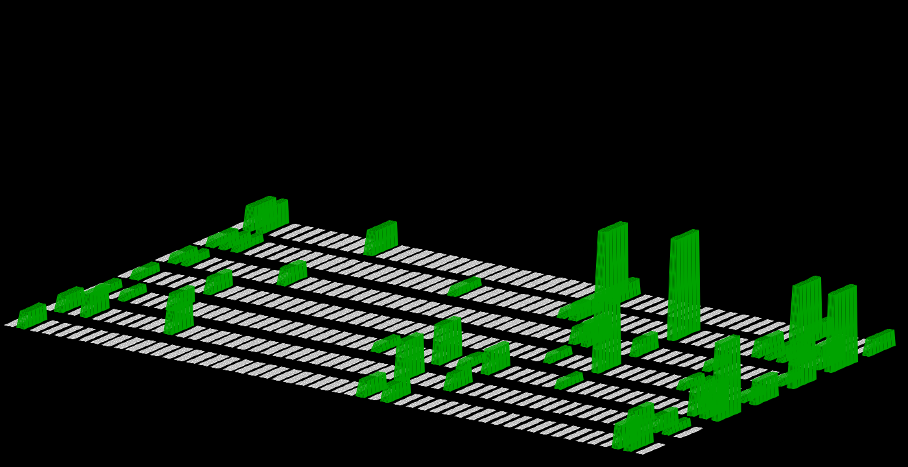

# Hello

```kotlin
fun me() = me {
    name = "Dinu Blanovschi"

    links {
        github = "https://github.com/dnbln"
        home = "https://dnbln.dev"
        mail = "mailto:git@dnbln.dev"
    }

    languages {
        rust
        kotlin
    }
}
```


